# Age of Empires 4 Project


## 1. Project Overview
AoE4 or AOE4 refers to Age of Empires IV

### 1.1 General information

Age of Empires IV is a Real Time Strategy genre video game based on the early medieval ages. The game revolves in the balancing of economy and military to defeat the opponent(s) based on strategy and tactics. 

As in the time of writing, there are 16 civilizations available to play:
- Abbasid Dynasty
- Chinese
- Delhi Sultanate
- English
- French
- Holy Roman Empire
- Mongols
- Rus
- Ottomans
- Malians
- Byzantines
- Japanese
- Ayyubids
- Jeanne d'Arc
- Order of the Dragon
- Zhu Xi's Legacy

In the competitive mode of this game, it can be played as 1 vs 1, or in teams  2 vs 2, 3 vs 3 or 4 vs 4. Based on the results of playing you can get ranking in game which are from worst to best as follows: 
- Bronze
- Silver
- Gold
- Platinum
- Diamond
- Conqueror

And each of this have 3 subdivisions from 1, 2 and 3 where 1 is the lowest ranked from the ranking. So a Conqueror 3 has a higher ranking than a Conqueror 2.

### 1.2 Scope & Goals

#### 1.2.1 Scope
Scope: Obtain information from the AOE 4 World web page, and have more details about the leaderboards (ranked list) and games played in Age of Empires 4. 

#### 1.2.2 Goals

From Ranked List:
- How many players are ranked in AOE4 in the current season and from where they play more? 
- How many players from a country are qualified in the rank ladder?
- What is the ranking of a specific player to the total players and from my country. 

Games List:
- What are the wining/loss rate between the best players in Ranked 1v1 matches taking in consideration the civilizations used?
- What are the average game time per civilization in each map?
- What is the average game duration per rank?
- How many games in average are played by the high ranked players compared to the average rank. 

### 1.4 Limitations, Considerations & Point of improvement

#### 1.4.1 Limitations
- Not all the information can be obtained from AoE4 World with the API.
- The details from the actions of the players per specific games are not obtainable via the specific API.
- Only the last 1000 games from a specific player can be obtained from the API. For consideration: If player 1 have a 1001 games, his last 1000 games can be obtained, but the 1st game could be obtained if his 1st opponent does not have a 1000 games. This information can be obtain later when the historical data is added to the data dumps.
- Data from games played on season 1 and 2 are not easily available as there are no data dumps on this specific seasons.


#### 1.4.2 Considerations
- The data would not be always be updated as it is not intended to call the API repeatedly to obtain or download all the information at once. If the information is needed you can enter AOE4 World and most likely you should have the information that you need.
- The value obtained at certain time for the statistics can be volatile as the players ranking can change easily their ranks based on their results so the values can change and give various result. It could be also be done based on the value of the players elo but it can also have a similar volatility. 


## 2. Extracting Data

### 2.1 Extracting the AOE4 Data Ranked Matches 1v1 

This returns as a result the following: 
- Ranked List of Players (1v1)
- The last 1000 games of the players from all seasons (Players that are in the Ranked List of Players 1v1)

This takes into consideration if all the available information from the API is intended to be gather that would be the last 1000 games. 

This is the [link](https://aoe4world.com/dumps) were the data dumps since season 3 that are available. Data can be worked with this basis but the data structure is not exactly the same as the one from the information downloaded by the API. 

```python
import json
import requests
import pandas as pd
import os
import time
from dotenv import load_dotenv

start_time = time.time()

## Ranking List
value = 1
ranked_players =''
while True:
    try:
        aoe_games_parameters = {'page': value}
        aoe_games_api = requests.get("https://aoe4world.com/api/v0/leaderboards/rm_solo", params = aoe_games_parameters)
        aoe_games_json = json.dumps(aoe_games_api.json()['players'])
        mid_string = aoe_games_json[1:-1] + ', '
        ranked_players = ranked_players+mid_string
        value = value + 1
        
    except json.decoder.JSONDecodeError:
        print(f"Final page {value}")
        break
ranked_players_json = '[' + ranked_players[:-2] + ']'
ranked_players_path_dir = os.getenv('player_rankings')
with open(f'{ranked_players_path_dir}','w') as data:
    data.write(ranked_players_json)

df = pd.read_json(ranked_players_json)

## Ranking List obtained as a result

## Games Played by list players

i=0
path_dir = os.getenv('path_dir_end')

for i in range(len(df['profile_id'])):
    profile_id = df['profile_id'][i]    ##Selecting the player which games are going to be obtained
    print(f"Player {i} - {profile_id} - {df['name'][i]}") ## Just to see that what is printing
    games_info =''
    page = 1
    player_name = df['profile_id'][i] ## here changed from the originial to player_id
    #print(player_name)
    player_id = str(player_name)+".json"
    
    

    if os.path.exists(path_dir+player_id):
        
        f = open(path_dir+player_id, 'r')
        games_record = json.load(f)
        last_date = games_record[0]['started_at']
        games_info =''
        page = 1
        while True:
                try:
                    if page >= 21: ## take into consideration that the max amount of pages that can be obtained are 20
                        break
                    else:    
                        aoe_games_parameters = {'page': page, 'leaderboard': 'rm_1v1', 'profile_ids':1270139, 'since':last_date}
                        aoe_games_info_api = requests.get("https://aoe4world.com/api/v0/games", params = aoe_games_parameters)
                        aoe_games_info_json = json.dumps(aoe_games_info_api.json()['games'])
                        mid_string = aoe_games_info_json[1:-1] + ', '
                        games_info = games_info + mid_string
                        page = page + 1
                except json.decoder.JSONDecodeError:
                    break
        if games_info == ', ':
            pass
        else:
            games_info = '[' + games_info[:-2] + ', '
            record = json.dumps(games_record)[1:]
            new_record = games_info + record

            with open(f'{path_dir+player_id}', 'w') as data:
                data.write(new_record)

        
    else:
        while True:
            try:
                if page >= 21: ## take into consideration that the max amount of pages that can be obtained are 20
                    break
                else:    
                    aoe_games_parameters = {'page': page, 'leaderboard': 'rm_1v1', 'profile_ids':profile_id}
                    aoe_games_info_api = requests.get("https://aoe4world.com/api/v0/games", params = aoe_games_parameters)
                    aoe_games_info_json = json.dumps(aoe_games_info_api.json()['games'])
                    mid_string = aoe_games_info_json[1:-1] + ', '
                    games_info = games_info + mid_string
                    page = page + 1
            except json.decoder.JSONDecodeError:
                break
        games_info = '[' + games_info[:-2] + ']'
        with open(f'{path_dir+player_id}','w') as data:
            data.write(games_info)
        i=i+1

print('end')
print("Process finished --- %s seconds ---" % (time.time() - start_time))
```
### 2.2 Ranked Team Leaderboard directly for Power BI Script

The script that was created was for obtaining directly the information from the AOE4 world page directly to the Dashboard created.

The following script was created: 

``` Python

import json
import sys
import requests
import pandas as pd

value = 1
ranked_players =''
while True:
    try:
        
        aoe_games_parameters = {'page': value}
        aoe_games_api = requests.get("https://aoe4world.com/api/v0/leaderboards/rm_team", params = aoe_games_parameters)
        aoe_games_json = json.dumps(aoe_games_api.json()['players'])
        mid_string = aoe_games_json[1:-1] + ', '
        ranked_players = ranked_players+mid_string
        value = value + 1
        
    except json.decoder.JSONDecodeError:
        print(f"Final page {value}")
        break
ranked_players_json = '[' + ranked_players[:-2] + ']'

df = pd.read_json(ranked_players_json)


print(df)

```

## 3. Review of Data

### 3.1 Data Structure from Ranked List of Players Current Season

Data structure from the Rank listed player from the current season

From the initial request the JSON the following information is obtained: 

- query (string)
- key (string)
- short_name (string)
- name (string)
- site_url (string)
- players (list)
- total_count (int)
- page (int)
- per_page (int)
- count (int)
- offset (int)


Reviewing the 'players' list, it can be seen each players with a dictionary can be observed. In the dictionary the following can found:

- name (string)
- profile_id (int)
- steam_id (string)
- site_url (string)
- avatars (dictionary)
- country
- social (dictionary)
- twitch_url (string)
- twitch_is_live (boolean)
- rating (int)
- max_rating (int)
- max_rating_7d (int)
- max_rating_1m (int)
- rank (int)
- rank_level (string)
- streak (int)
- games_count (int)
- wins_count (int)
- losses_count (int)
- drops_count (int)
- last_game_at (string)
- win_rate (float)
- last_rating_change (int)

Reviewing the 'avatars' list, it can be seen different size photos within a dictionary can be observed. In the dictionary the following can found:

- small (string)
- medium (string)
- full (string)

Reviewing the 'social' list, it can be seen different social medias within a dictionary can be observed. In the dictionary the following can found:

- twitch
- twitter
- youtube
- liquipedia

### 3.2 Data Structure from Players Games from API

Data structure from the Game Information

From the initial reques the JSON we get have the following information
- page (int)
- per_page (int)
- count (int)
- offset (int)
- filters (dictionary)
- games (list)

The 'filters' contain all the parameters used in the request

Reviewing the 'games' list, it can be seen each individual game with a dictionary. In the dictionary the following can found

- game_id (int)
- started_at (time)
- updated_at (time)
- duration (int)
- map (string)
- kind (string - type of match up rm1v1 etc)
- leaderboard (string related to 'kind')
- season (int)
- server (string)
- patch (string)
- average_rating (int)
- ongoing (boolean)
- just_finished (boolean)
- teams (list)

Inside the teams there are two list from the opposing teams, and then another list that contain the players of the team detail. 

Some of the information that can be obtain from each individual players is: 
- profile_id (int)
- name (string)
- result (string)
- civilization (string)
- civilization_randomized (string)
- rating (int)
- rating_diff

### 3.3 Data Structure from Players Games from Data Dumps


Data structure from the Game Information form the Data Dumps that are the games obtained from past seasons (does not include current)

Reviewing the 'games' list, it can be seen each individual game with a dictionary. In the dictionary the following can found

- game_id (int)
- started_at (time)
- finished_at (time) 
- duration (int)
- map_id (int)
- map (string)
- kind (string - type of match up rm1v1 etc)
- server (string)
- patch (string)
- teams (list)

Inside the teams there are two list from the opposing teams, and then another list that contain the players of the team detail. 

Some of the information that can be obtain from each individual players is: 
- profile_id (int)
- result (string)
- civilization (string)
- civilization_randomized (string)
- rating (int)
- rating_diff
- mmr (int)
- mmr_dif (int)

### 3.4 Difference between structure from API and Data Dumps

From the General Game data

| API            | Dumps       | Data Type |
| -------------- | ----------- | --------- |
| game_id        | game_id     | Integer   |
| started_at     | started_at  | Time      |
| updated_at     | -           | Time      |
| -              | finished_at | Time      |
| duration       | duration    | Integer   |
| -              | map_id      | Integer   |
| map            | map         | String    |
| kind           | kind        | String    |
| leaderboard    | -           | String    |
| season         | -           | Integer   |
| server         | server      | String    |
| patch          | patch       | String    |
| average_rating | -           | Integer   |
| ongoing        | -           | Boolean   |
| just_finished  | -           | Boolean   |
| teams          | teams       | List      |

From the teams list from the Game data

| API                     | Dumps                   | Data Type |
| ----------------------- | ----------------------- | --------- |
| profile_id              | profile_id              | Integer   |
| name                    | \-                      | String    |
| result                  | result                  | String    |
| civilization            | civilization            | String    |
| civilization_randomized | civilization_randomized | Boolean   |
| rating                  | rating                  | Integer   |
| rating_diff             | rating_diff             | Integer   |
| \-                      | mmr                     | Integer   |
| \-                      | mmr_dif                 | Integer   |


## 4. Drafting potential Data Structures to use for the Power BI Model

### 4.1 Possible Structures for visualize data in Power BI

## 5. Structuring Data

### 5.1 All AOE Games Consolidation

To take into consideration, based on the volume of data it might not be the most efficient way to work with this data in a consolidated format. 

``` Python
import os
import json
import glob
from dotenv import load_dotenv

# Data Structure consideration
# Reading Data 
path_dir = os.getenv('path_dir_source')
path_dir_save = os.getenv('path_dir_end')

file_name = 'all_games_consolidation'
final_games_json=''
i=0
for files in os.listdir(path_dir):
    if i == 0:
        f = open(path_dir+files, 'r')
        load_player_match_history = json.load(f)
        player_match_history = json.dumps(load_player_match_history)
        all_player_match_history = player_match_history[1:-1] + ', '
        i=i+1
    else:
        print(files)
        f = open(path_dir+files, 'r')
        load_player_match_history = json.load(f)
        player_match_history = json.dumps(load_player_match_history)
        all_player_match_history = all_player_match_history + player_match_history[1:-1] + ', '
        i=i+1
        print(i)
        
all_player_match_history = '[' + all_player_match_history[:-2] + ']'
with open(f'{path_dir_save+file_name}','w') as data:
        data.write(all_player_match_history)
```

### 5.2 Structuring Games Data - General Information from the games

``` Python
import os
import json
import pandas as pd
from dotenv import load_dotenv

# Remove duplicate games

path_dir = os.getenv('path_dir_source')
consolidated_data_file = 'all_games_consolidation.json'

f = open(path_dir+consolidated_data_file, 'r')
aoe_games_full_json = json.load(f)
aoe_games_full_json =json.dumps(aoe_games_full_json)


df_aoe_games_full = pd.read_json(aoe_games_full_json)
df_aoe_games_full= df_aoe_games_full.drop(columns=['teams'])

final_file_path_dir = os.getenv('path_dir_end')
final_file_name = 'final_players_games.csv'
df_aoe_games_full.to_csv(final_file_path_dir+final_file_name, index=False)
print('end')
```

### 5.3 Structuring Games Data - Players in Game Information 1

``` Python
import os
import json
import pandas as pd
from dotenv import load_dotenv

path_dir = os.getenv('path_dir_source')
consolidated_data_file = 'all_games_consolidation.json'

f = open(path_dir+consolidated_data_file, 'r')
aoe_games_full_json = json.load(f)


l_game_id = []
l_profile_id = []
l_name = []
l_result = [] 
l_civilization = []
l_civilization_randomized = []
l_rating = []
l_rating_diff = []


print(range(len(aoe_games_full_json)))
for i in range(len(aoe_games_full_json)):
    print(i)
    for list_team in range(len(aoe_games_full_json[i]['teams'])):
        for list_players in range(len(aoe_games_full_json[i]['teams'][list_team])):
            for list_players in range(len(aoe_games_full_json[i]['teams'][list_team][list_players])):
                                    l_game_id.append(aoe_games_full_json[i]['game_id'])
                                    l_profile_id.append(aoe_games_full_json[i]['teams'][list_team][list_players]['player']['profile_id'])
                                    l_name.append(aoe_games_full_json[i]['teams'][list_team][list_players]['player']['name'])
                                    l_result.append(aoe_games_full_json[i]['teams'][list_team][list_players]['player']['result'])
                                    l_civilization.append(aoe_games_full_json[i]['teams'][list_team][list_players]['player']['civilization'])
                                    l_civilization_randomized.append(aoe_games_full_json[i]['teams'][list_team][list_players]['player']['civilization_randomized'])
                                    l_rating.append(aoe_games_full_json[i]['teams'][list_team][list_players]['player']['rating'])
                                    l_rating_diff.append(aoe_games_full_json[i]['teams'][list_team][list_players]['player']['rating_diff'])

dictionary_games_played = {
    'game_id': l_game_id,
    'profile_id': l_profile_id,
    'name': l_name,
    'result': l_result,
    'civilization': l_civilization,
    'civilization_randomized': l_civilization_randomized,
    'rating': l_rating,
    'rating_diff': l_rating_diff

}


df=pd.DataFrame(dictionary_games_played)
df = df.drop_duplicates(subset=['game_id', 'profile_id'])

df_filter = df
df_filter.to_csv('final_games_players.csv', index=False)
print(df_filter.head())

```


```Python
import pandas as pd
from dotenv import load_dotenv

path_dir = os.getenv('path_dir_source')
f = open(path_dir+consolidated_data_file, 'r', encoding='utf-8')
playes_games = pd.read_csv(f)
playes_games['subindex']=playes_games.groupby(by='game_id').cumcount()

playes_games_0 = playes_games[playes_games.subindex==0]
playes_games_1 = playes_games[playes_games.subindex==1]
#print(playes_games_0.head())
#print(playes_games_1.head())

players_a = playes_games_0.merge(playes_games_1, how= 'left', on='game_id', suffixes=("_p","_o"))
players_b = playes_games_1.merge(playes_games_0, how= 'left', on='game_id', suffixes=("_p","_o"))
print(players_a.shape)
print(players_b.shape)
final_list = pd.concat([players_a,players_b])
final_list = final_list.drop(columns=['subindex_p','subindex_o'])
print(final_list.shape)
final_file_path_dir = os.getenv('path_dir_end')
final_file_name = 'final_players_games2.csv'
final_list.to_csv(final_file_path_dir+final_file_name, index=False)

final_file_name_a = 'final_players_games_a.csv'
players_a.to_csv(final_file_path_dir+final_file_name_a, index=False)

final_file_name_b = 'final_players_games_b.csv'
players_b.to_csv(final_file_path_dir+final_file_name_b, index=False)
```

#### 5.3.1 Reviewing information from the transformed tables

After transforming all the information that was obtained from the API, an evaluation of the information was made in the Power BI table editor. Most of the data had the expected values, but there were some cases were some of the field contained some unexpected values as invalid games appeared that might be caused by the game before the match was starting or during the match. This information events must not be analyzed for making a profile of how players performed, but can be useful to observe how many games had problems as the game were starting or while it was in progress. 

An example of this unexpected values can be seen in fields like the players result of the game not being either win or loss while the game was not ongoing, or that the civilization of the player or the opponent appeared as blank or as "unknown". 

### 5.4 Strucutring informations from past seasons - Data Dumps

The information from past season have most of all players games except the ones played in seasons 1 and 2. It is already a JSON file to analyze directly without making constants calls to the API that would end with the same result based on the restrictions added. As recalled before, the data is similar to the one obtained with the API and the data missing can be added with other methods.  The only  work needed to be done is to structure the information as the one obtain from the API. 

The information missing is just the players name, which can be added as there is the players 'id' but no name and can be added via the players list. In this case it needs to be considered that 


The structuring code was as follows:

``` Python
import os
import json
import pandas as pd
from dotenv import load_dotenv

# Loading all games played in a specific season
load_dotenv()    
f = open(os.getenv('path_dir_source_games'), 'r')
aoe_games_full_json = json.load(f)

# List of fields that want to be obtained

l_game_id = []
l_profile_id = []
l_name = []
l_result = [] 
l_civilization = []
l_civilization_randomized = []
l_rating = []
l_rating_diff = []

# Obtaining information from games

print(range(len(aoe_games_full_json)))
for i in range(len(aoe_games_full_json)):
    print(i)
    for list_team in range(len(aoe_games_full_json[i]['teams'])):
        for list_players in range(len(aoe_games_full_json[i]['teams'][list_team])):
            for list_players in range(len(aoe_games_full_json[i]['teams'][list_team])):
                                    l_game_id.append(aoe_games_full_json[i]['game_id'])
                                    l_profile_id.append(aoe_games_full_json[i]['teams'][list_team][list_players]['profile_id'])
                                    l_result.append(aoe_games_full_json[i]['teams'][list_team][list_players]['result'])
                                    l_civilization.append(aoe_games_full_json[i]['teams'][list_team][list_players]['civilization'])
                                    l_civilization_randomized.append(aoe_games_full_json[i]['teams'][list_team][list_players]['civilization_randomized'])
                                    l_rating.append(aoe_games_full_json[i]['teams'][list_team][list_players]['rating'])
                                    l_rating_diff.append(aoe_games_full_json[i]['teams'][list_team][list_players]['rating_diff'])

dictionary_games_played = {
    'game_id': l_game_id,
    'profile_id': l_profile_id,
    'result': l_result,
    'civilization': l_civilization,
    'civilization_randomized': l_civilization_randomized,
    'rating': l_rating,
    'rating_diff': l_rating_diff

}

df=pd.DataFrame(dictionary_games_played)
print(df.shape)


# Even though it is not necesary, an inner join is going to be used with players obtained from the leaderboard so less information needs to be added to the model for this project.

# Obtaining leaderboard information
g = open(os.getenv('path_dir_source_leaderboard'), 'r')
aoe_leaderboard = json.load(g)
df1 = pd.DataFrame(aoe_leaderboard)
df1 = df1[['name', 'profile_id']]


# Joining the data
df3 = pd.merge(df,df1, on='profile_id', how='inner')
df3 = df3[['game_id', 'profile_id', 'name', 'result', 'civilization', 'civilization_randomized', 'rating', 'rating_diff']]
df3.to_csv(os.getenv('path_dir_end_game_details'), index=False)
```

### 5.5 Strucuring Data for Ranked Team Games

The data show a list of the team ranking data has the same structure as the one used for 1v1. Here based on the initial visualization project and some considerations some data transformation was needed. In this case, the data transformation was made not in Python but it was made on PowerQuery from Power BI.  The base data from the ranked team list is intended to be used as a data source from the Python script so the data could be updated as desired by the user.

From the base table obtained from the API, some fields were change via Power Query. The changes made were in the "rank_level" to obtain the final result of the ranking by changing the how the string is constructed. This could have been also worked with another table like the one used in the 1v1. 

Additionally, the name of the country was added to the base table by merging the iso code country table via the "country" column from the base table and the "ISO2 CODE" from the "countries-code" table, therefore the final country name will be  with the base API table. When loading the data, it was verified that no blank countries were found, and in this case one was not consider in the initial country list relation and was added into the data base.   

A consideration to the information that has been added to the main table which could also been handled with another primary table with the corresponding information as it was done on the ranked 1v1 visualization is that when loading the data on the visualization, it would take less time to load to a full table. Take into consideration here that information would load faster if you want to present a great amount of data into a table visualization which this is the case, but if there is a smaller limit on the table visualization it would be basically the same time. This is not efficient if more tables would need to be added to the workspace. 

Some extra data transformation done to the table, was to change how the ranking string was presented and add an extra column to obtain the overall ranking level.

Here is the M script without the section that starts with the Python source script.  

``` PowerQuery

    df1 = Origen{[Name="df"]}[Value],
    #"Tipo cambiado" = Table.TransformColumnTypes(df1,{{"name", type text}, {"profile_id", Int64.Type}, {"steam_id", Int64.Type}, {"site_url", type text}, {"avatars", type text}, {"country", type text}, {"social", type text}, {"twitch_url", type text}, {"twitch_is_live", type logical}, {"rating", Int64.Type}, {"max_rating", Int64.Type}, {"max_rating_7d", Int64.Type}, {"max_rating_1m", Int64.Type}, {"rank", type text}, {"rank_level", type text}, {"streak", Int64.Type}, {"games_count", Int64.Type}, {"wins_count", Int64.Type}, {"losses_count", Int64.Type}, {"drops_count", Int64.Type}, {"last_game_at", type datetime}, {"win_rate", type number}, {"last_rating_change", Int64.Type}}),
    #"Consultas combinadas" = Table.NestedJoin(#"Tipo cambiado", {"country"}, #"countries-codes", {"ISO2 CODE"}, "countries-codes", JoinKind.LeftOuter),
    #"Se expandió countries-codes" = Table.ExpandTableColumn(#"Consultas combinadas", "countries-codes", {"LABEL EN.1", "LABEL SP.1"}, {"countries-codes.LABEL EN.1", "countries-codes.LABEL SP.1"}),
    #"Valor reemplazado" = Table.ReplaceValue(#"Se expandió countries-codes","_"," ",Replacer.ReplaceText,{"rank_level"}),
    #"Poner En Mayúsculas Cada Palabra" = Table.TransformColumns(#"Valor reemplazado",{{"rank_level", Text.Proper, type text}}),
    #"Texto insertado antes del delimitador" = Table.AddColumn(#"Poner En Mayúsculas Cada Palabra", "Texto antes del delimitador", each Text.BeforeDelimiter([rank_level], " "), type text),
    #"Columnas con nombre cambiado" = Table.RenameColumns(#"Texto insertado antes del delimitador",{{"countries-codes.LABEL SP.1", "nombre_pais"}, {"countries-codes.LABEL EN.1", "country_name"}, {"Texto antes del delimitador", "overall_rankings"}})
in
    #"Columnas con nombre cambiado"

```


After the transformation, the final player ranking list had the following fields:

| Field              | Data Type | Description                                                                                                                                                      |
| ------------------ | --------- | ---------------------------------------------------------------------------------------------------------------------------------------------------------------- |
| name               | String    | Name of the player                                                                                                                                               |
| profile_id         | Integer   | Player identifier number                                                                                                                                         |
| steam_id           | Integer   | Player Steam identifier number if he plays using Steam                                                                                                           |
| site_url           | String    |                                                                                                                                                                  |
| avatars            | String    |                                                                                                                                                                  |
| country            | String    | Country shown as ISO code 2                                                                                                                                      |
| social             | String    | Display all socials linked to the player (Twitch, X (formerly Twitter), YouTube, Instagram and Liquipedia)                                                       |
| twitch_url         | String    |                                                                                                                                                                  |
| twitch_is_live     | Boolean   |                                                                                                                                                                  |
| rating             | Integer   |                                                                                                                                                                  |
| max_rating         | Integer   |                                                                                                                                                                  |
| max_rating_7d      | Integer   |                                                                                                                                                                  |
| max_rating_1m      | Integer   |                                                                                                                                                                  |
| rank               | String    |                                                                                                                                                                  |
| rank_level         | String    |                                                                                                                                                                  |
| streak             | Integer   | Number of consecutive result obtained by the player (if the number is positive, that means a winning streak and if it is negative it relates to a losing streak) |
| games_count        | Integer   |                                                                                                                                                                  |
| wins_count         | Integer   |                                                                                                                                                                  |
| loses_count        | Integer   |                                                                                                                                                                  |
| drops_count        | Integer   |                                                                                                                                                                  |
| last_game_at       | Date      | The date of the last match played                                                                                                                                |
| win_rate           | Float     |                                                                                                                                                                  |
| last_rating_change | Integer   |                                                                                                                                                                  |
| overall_ranking    | String    |                                                                                                                                                                  |

## 6. Visualizations

### 6.1 All player profiles and matches
This the first overall visualization of this project:

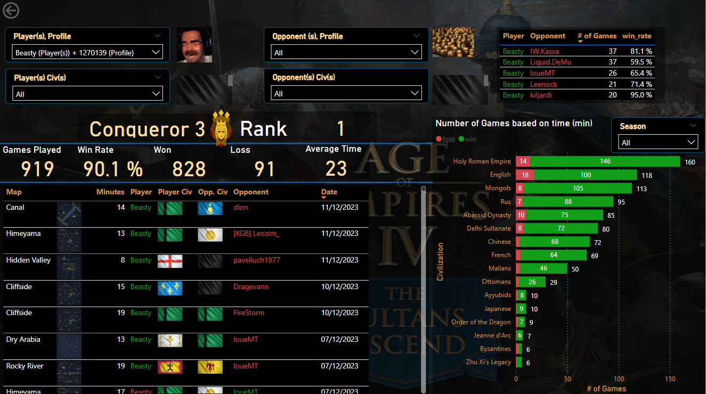

In this dashboard the following can be seen: 

#### Slicers

Five slicers can be observed from the dashboard:
- Player(s) Profile
- Player(s) Civ(s)
- Opponent(s) Profile
- Opponent(s) Civ(s)
- Season

The slicers that contains the players (Player(s) Profile and Opponent(s) Profile) have the possibility to select the players by either the name or the the players ID number. 


#### General information from the player

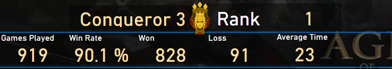

In the top the following information can be seen from the player selected: 
- Specific ranked level
- Rank level badge
- Rank in leaderboard

Below that information that can be seen are:
- Games Played
- Win Rate
- Games Won
- Games Lost
- Average Game Time

Most of the field in the tool tip have been worked with measurements, except the 'Rank level' and the 'Rank level badge'. 

- **Rank in leaderboard**
``` DAX

Player_Rank2 =

    IF(DISTINCTCOUNT(final_players_games[profile_id_p])<=1,
        IF(
            ISBLANK(CONCATENATEX(players, players[rank],"")),
            "Unranked",
            CONVERT(CONCATENATEX(players, players[rank],""),STRING)
            )
    , "-"
    )

```

- **Games Played**

``` DAX

total_games = 

	CALCULATE(DISTINCTCOUNT(final_players_games[game_id]))

```


- Win Rate

``` DAX

win_rate =

	CALCULATE(
        COUNT(final_players_games[game_id]),
        final_players_games[result_p] = "win",
        final_players_games[civilization_p] <> BLANK()
        )
    /
    CALCULATE(
        COUNT(final_players_games[game_id]),
        final_players_games[civilization_p] <> BLANK()
        )
```

- **Games Won**

``` DAX

total_win =

	CALCULATE(
	    COUNT(final_players_games[game_id]),
	    final_players_games[result_p] = "win"
	    )
```

- **Games Lost**
``` DAX

total_loss =

    IF(
        CALCULATE(
            COUNT(final_players_games[game_id]),
            final_players_games[result_p] = "loss",
            final_players_games[civilization_p] <> BLANK()
            )
        = BLANK(),
        0,
        CALCULATE(
            COUNT(final_players_games[game_id]),
            final_players_games[result_p] = "loss",
            final_players_games[civilization_p] <> BLANK()
            )
    )
    
```

- **Average Game Duration**

``` DAX

avg_duration =
	
	CALCULATE(SUM(Matches_Database_Update[duration(min)]))/[total_games]
	
```
#### Match History

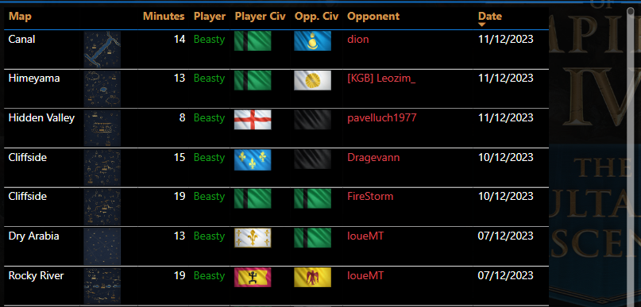

The information from the matches played is displayed until the last data collection was done. The data that can be seen in this table are the following: 
- Map
- Map (Image)
- Minutes played
- Player (The one selected for analysis)
- Player Civ
- Opponent Civ
- Opponent 
- Date (of the match)

In this table, the name of the player that won is in green whereas the one that lost is in red. Additionally, a tool tip has been added to the table so a quick resume of the opponents rank level from the current season and number of games can be seen. 

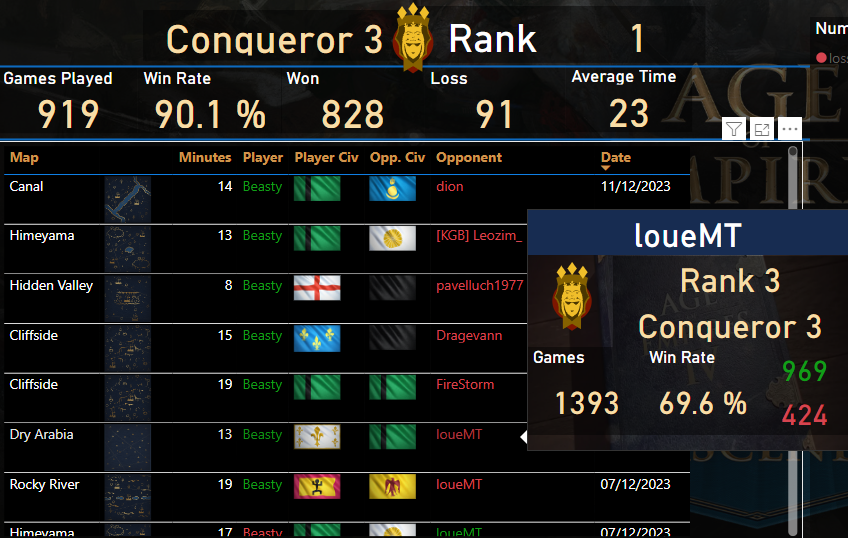

##### Opponent Tool Tip

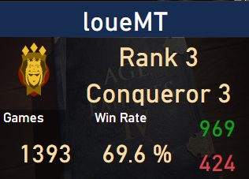

In this tool tip the following can be seen from the opponent player selected:
- Name
- Rank in leaderboard
- Rank level
- Rank level badge
- Number of games
- Win Rate
- Games won
- Games lost

Most of the field in the tool tip have been worked with measurements, except 'Name' and the 'Rank level badge'.

Here are the respective measures for each field:

- **Rank in leaderboard**

``` DAX

Opp_rank =
    IF(
        ISBLANK(CONCATENATEX(opponents, opponents[rank],"")),
        "Unranked",
        CONCATENATE("Rank ", CONVERT(CONCATENATEX(opponents, opponents[rank],""),STRING))
        )
```

- **Rank level**

``` DAX

Opp_rank_level =
    IF(       ISBLANK(CONCATENATEX(AOE4_Ranks_Opponents,AOE4_Ranks_Opponents[rank],"")),
        "Unranked",
        CONCATENATEX(AOE4_Ranks_Opponents, AOE4_Ranks_Opponents[rank])
        )
```

- **Number of games**

``` DAX
Opp_total_games =

CALCULATE(
    DISTINCTCOUNT(final_players_games[game_id]),
    ALL(Matches_Database_Update),    ALL(final_players_games[civilization_p],final_players_games[profile_id_p], final_players_games[name_p], final_players_games[civilization_o] , final_players_games[result_p]),

    ALL(AOE4_Civilizations_Opponents),

    ALL(AOE4_Civilizations_Players),

    final_players_games[result_o] = "win" || final_players_games[result_o] = "loss"

    )

```

- **Win Rate**

``` DAX

Opp_win_rate = Calc_Opp_Tooltip[Opp_wins]/Calc_Opp_Tooltip[Opp_total_games]

```

The calculations for this measure was based on "Games Won" divided by "Number of Games".

- **Games Won**

``` DAX 

Opp_wins =

CALCULATE(
    DISTINCTCOUNT(final_players_games[game_id]),
    ALL(Matches_Database_Update),
   ALL(final_players_games[civilization_p],final_players_games[profile_id_p], final_players_games[name_p], final_players_games[civilization_o] , final_players_games[result_p]),
    ALL(AOE4_Civilizations_Opponents),
    ALL(AOE4_Civilizations_Players),
    final_players_games[result_o] = "win"
    )

```

- **Games Lost**

``` DAX

opp_loss =
	CALCULATE(
    DISTINCTCOUNT(final_players_games[game_id]),
    ALL(Matches_Database_Update),
   ALL(final_players_games[civilization_p],final_players_games[profile_id_p], final_players_games[name_p], final_players_games[civilization_o] , final_players_games[result_p]),
    ALL(AOE4_Civilizations_Opponents),
    ALL(AOE4_Civilizations_Players),
    final_players_games[result_o] = "loss"
    )
``` 


#### Most common opponents

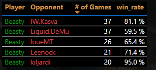

The most common opponents from the player from analysis can be observed. Based if the player have an above 50% win rate then the player name is displayed with green and the opponent name with red, if it is below 50% percent it would be the opposite. If the matchup between the players is exactly 50% the color yellow would be selected.

Here the same tooltip from the Match History was used. 

#### Number of Win/Loss by Civilization

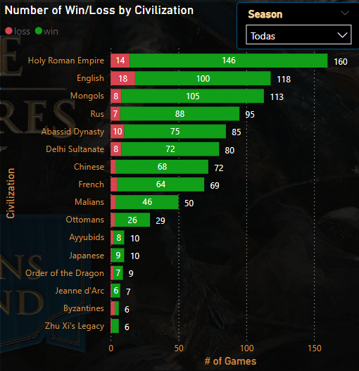

Here it can be seen all the civilization used by the player and the results with each civilization. Additional to that information that win rate percentage per civilization can be seen if hovered over the bar of a specific civilization.

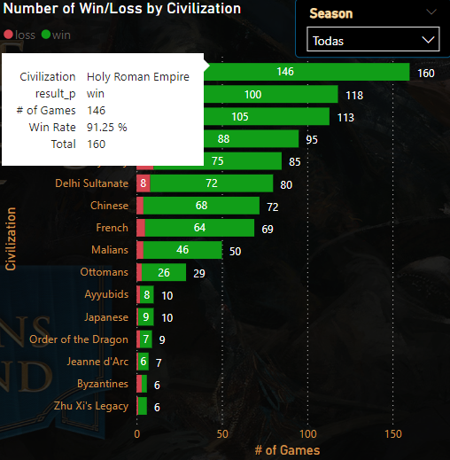


For the 'Win Rate' per civilization, the following measure was used: 

``` DAX

Player_win_rate = 
	Calc_Players[Player_wins]/Calc_Players[Player_total_games]

```

The 'Player_wins' were calculated with the following measurement: 

``` DAX

Player_wins =

    CALCULATE(
        DISTINCTCOUNT(final_players_games[game_id]),
        ALL(Matches_Database_Update),
        ALL(final_players_games[civilization_p], final_players_games[civilization_o] , final_players_games[result_p]),
        ALL(AOE4_Civilizations_Opponents),
        final_players_games[result_p] = "win"
        )

```


#### Filters used for this visualization

For the information that was need for the player profile, only all valid games were needed. For this only games were civilizations for both players appeared as one of the valid options, and that the result for both  were either win or loss.


### 6.2 Player ranking distribution and ranking order by country

This visualization have been made with the same concept from the Ranked Teams dashboards worked but in this case the information displayed is the ranked 1v1 information. 

The visualization aims to achieve to show the rankings players from a country or group of them or even a continent and show their specific ranking between the selected nations as well as the rank level distribution.  

This is the overall visualization:

 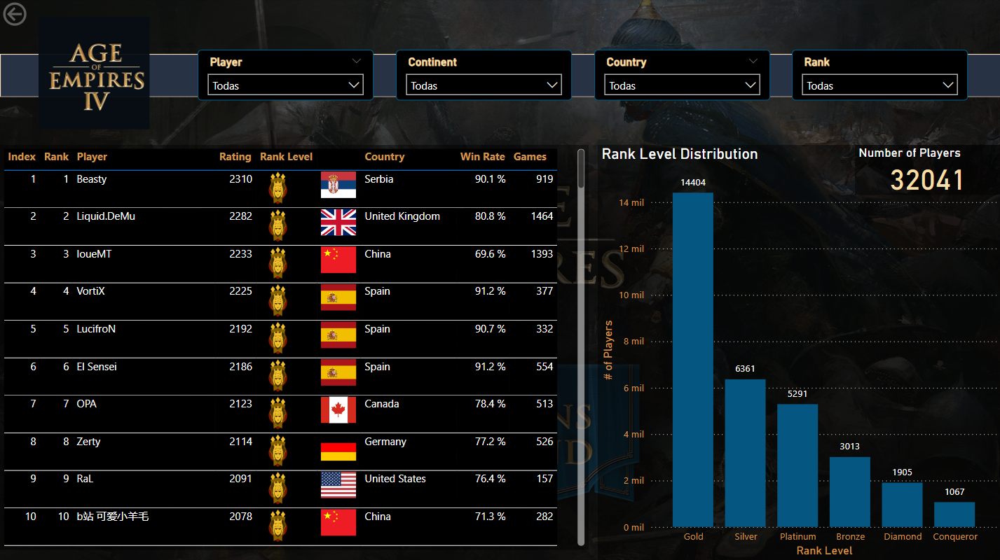

In this dashboard the following can be seen: 

#### Slicers

Four slicers can be observed from the dashboard: 
- Player
- Continent
- Country
- Rank

The slicer 'Player' contains all the name of the players and their specific profiles id's so if 2 players have the same name it can be searched up correctly.

#### Rank Table

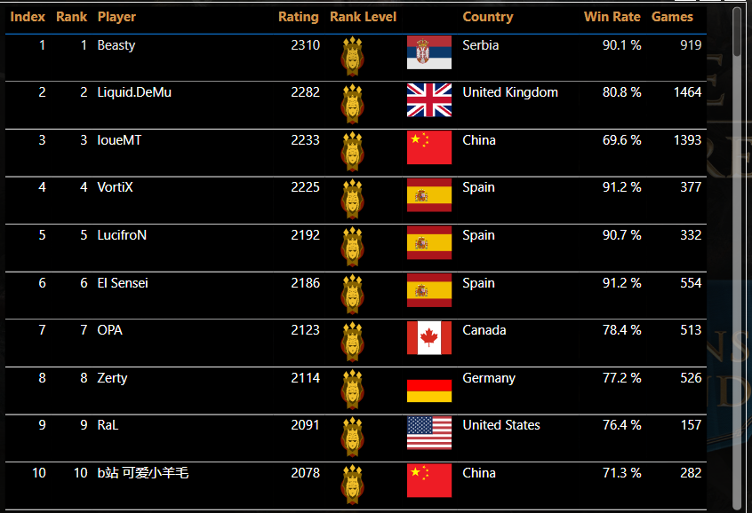

The information that can be observed in the table are: 
- Index
- Rank
- Player
- Rating
- Rank Level
- Country
- Win Rate
- Games

The index refers to position/ranking that the player is based on the nations or continents that have been selected. If there have not been selected any nation or continents in particular and is all the data available, the 'Index' would be the same as 'Rank'.

As an example on how the 'Index' column works here is the same visualization with 'South America' as a value in the 'Continent' slicer. 

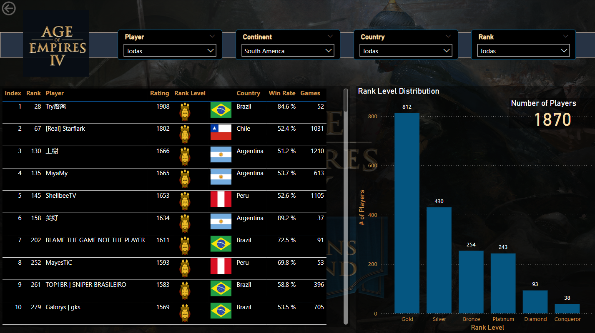

The table in this case presents a new indexation based on the nations selected which would be in this case South American nations. 

Considering this points, also when a specific rank is selected, the value of the 'Index' also considers players that are above in other ranks so there is continuity between the values. This if you select the specific ranking from the bar graph or the slicer.
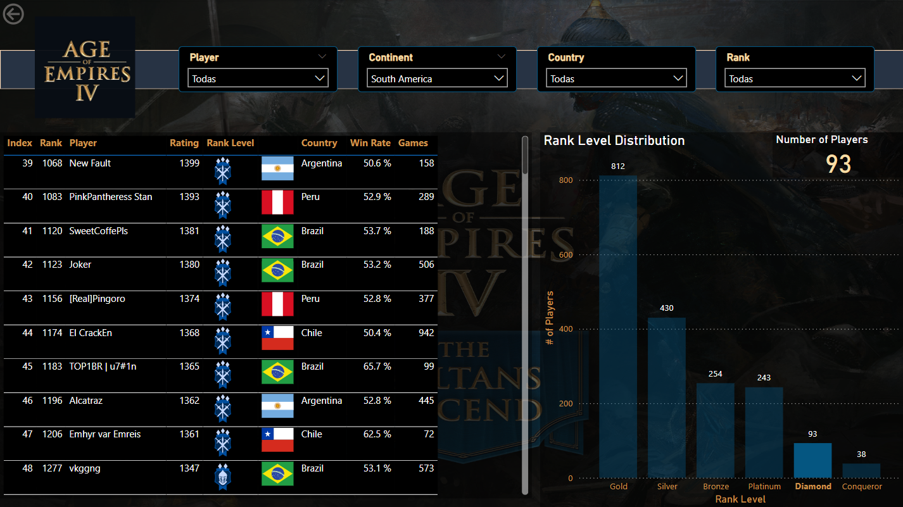

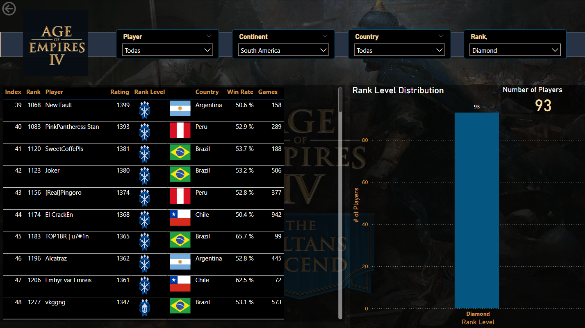

For the table, 3 of the fields were calculated, the 'Index', 'Win Rate' and ' Games'.

- **Index**

``` DAX

index =

    CALCULATE(
        COUNTROWS(players),
        FILTER(
            ALLEXCEPT(
                players,
                countries_iso_code[COUNTRY],
                countries_iso_code[CONTINENT]
                ),
            players[rank] <= Max(players[rank])
            ),
        all(AOE4_Ranks_Players[rank])
    )

```

- **Win Rate**

``` DAX

win_rate =

	CALCULATE(
        COUNT(final_players_games[game_id]),
        final_players_games[result_p] = "win",
        final_players_games[civilization_p] <> BLANK()
        )
    /
    CALCULATE(
        COUNT(final_players_games[game_id]),
        final_players_games[civilization_p] <> BLANK()
        )
        
```


- **Total Games**

``` DAX

total_games = 
	CALCULATE(
		DISTINCTCOUNT(final_players_games[game_id])
	)

```

#### Rank Level Distribution

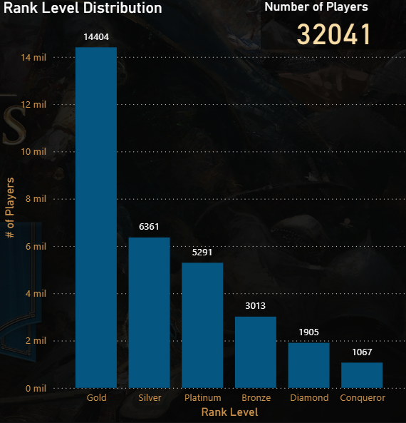

The bar graph shows the amount of player by ranking that are registered depending on the slicers used. In the top corner, a card with total amount of players can be seen. Additionally a tooltip was added to show the distribution of the specific ranking from each level. 

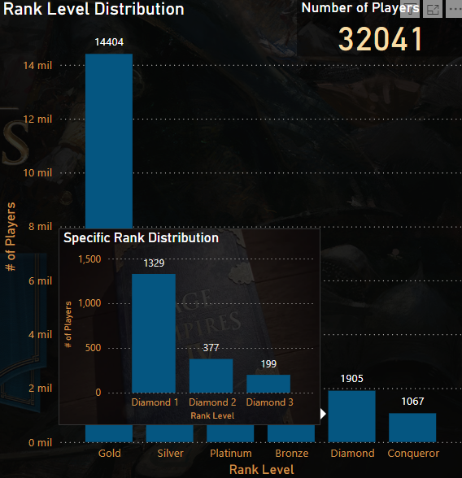

To obtain the amount of players for both of the graphs, the distinct count of the column 'profile_id' from the 'players' table was used.

### 6.4 Civilization Matchups

This the best civilization per map played of this project:


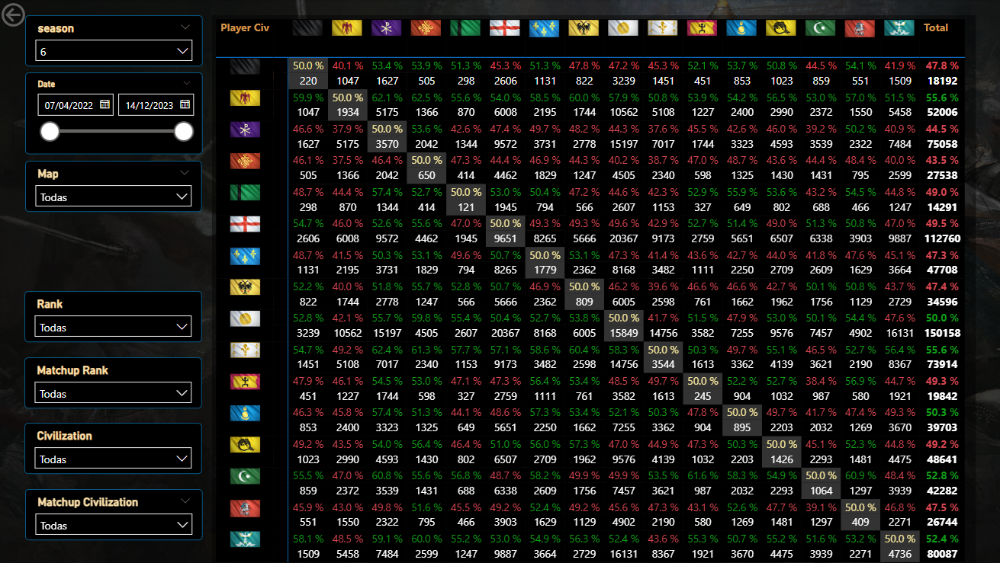

This dashboard is similar as the one that has been reviewed in the "6.3 Visualization of best civilization per map played" as the information presented in the second table without filters are shown in a different more visual representation that could be also useful if specific information wants to be seen. 

#### Slicers

Six slicers can be observed from the dashboard:
- Season
- Date
- Map
- Rank
- Matchup Rank
- Civilization
- Matchup Civilization


In the main table with all the results the following values can be seen

- Win rates of the civilization
- Number of games played

The first number that it shown is the win rate of a civilization against another one. The civilization of the player to the left and in the top side it is show the civilization of the opponent. The percentage is based on the civilization of the player. The percentage color depends only if the percentage is positive (green), negative (red) or equal (yellow) for the civilization in the specific matchup. The mirror matchup, meaning the same civilization used by the player and the opponent, has a different color so it can be differentiated from the others. The number of games is added so the sample that have been collected can be seen. 

The calculations used for the table are the following:

For the win rates:

``` DAX

ovr_civ_w/r = 
	IF(
	    AND([total_win] = BLANK(), [total_loss_ovr] >0),
	    0,
	    [total_win]/([total_win]+[total_loss_ovr])
	   )
```

``` DAX

total_win =
	CALCULATE(
	    COUNT(final_players_games[game_id]),
	    final_players_games[result_p] = "win"
	    )

```

``` DAX

total_loss_ovr =
	CALCULATE(
		COUNT(
			final_players_games[game_id]
			), 
		final_players_games[result_o] = "win"
	)


```


Number of games played:

``` DAX

total_games = 
	CALCULATE(
		DISTINCTCOUNT(final_players_games[game_id])
		)
		
```


#### Considerations of this Dashboard

This dashboard will always show the a 50% win rate in all mirror matchup without filters due to the civilizations being the same, but can have a different percentage if the rank level is used as a filter, as that would how that rank evaluates against the other ranks selected (If same ranks for the players and opponents are selected, the mirror matchup should always be 50%).  

### 6.5 Number of games and average - mean time per rank

This the number of games and average game time per rank of this project:


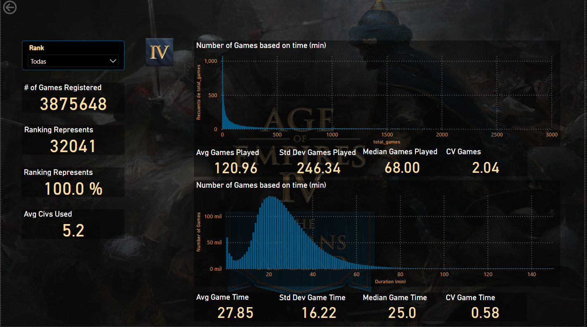

In this dashboard the following can be seen: 

#### Slicers

Only a single slicer was used: 
- Rank

#### General Information from the group of players

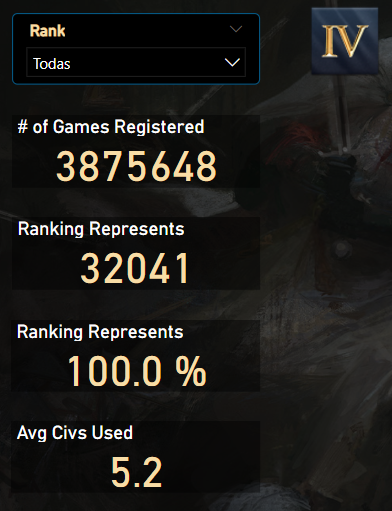

Here general information from the data is displayed. 

The number of game that have been registered from the amount of players that are selected. 

- "Ranking Represent"  the amount of players in the specific ranking selected, and the second one in percentage represents what amount of the player base was selected. 
- "Average Civs Used" refers to the number of civilization on average that are played by the selected ranking. 
- "Std Dev Civs Used" is the standard deviation of the number of civilizations played. 
- "Median Civs Used" displays the mean number of civilizations that are used by the ranks selected. 
- "CV Civs Used" shows the calculation of the coefficient of variation of the number of civilizations that are played in corresponding ranking. 

The calculations in DAX were made from the following calculations:

-  **# of Games Registered**

``` DAX

total_games = CALCULATE(DISTINCTCOUNT(final_players_games[game_id]))

```

- **Ranking Represents (Number)**

``` DAX

ranking_represent_n = DISTINCTCOUNT(final_players_games[profile_id_p])

```

- **Ranking Represents (Percentage)**

``` DAX

Specific_rank_vs_overall =
	DISTINCTCOUNT(players[profile_id]) / 
	CALCULATE(
		DISTINCTCOUNT(players[profile_id]), ALL(players)
	)

```

- **Avg Civs Used**

``` DAX

Civs_Used =
	var temp_table = 
	GROUPBY(
		final_players_games,
		final_players_games[profile_id_p], 
		final_players_games[civilization_p]
		)
	var total_civs = COUNTROWS(temp_table)

RETURN total_civs / DISTINCTCOUNT(final_players_games[profile_id_p])
```

- **Std Dev Civs Used** 

``` DAX

std_dev_civs_played =
    VAR player_civ_used = 
    GROUPBY(
	    final_players_games, 
	    final_players_games[profile_id_p], 
	    final_players_games[civilization_p]
	    )

    VAR count_number_of_civ_per_player = 
    SUMMARIZE(
	    players,
	    players[profile_id], 
	    "count_civ", 
	    DISTINCTCOUNT(final_players_games[civilization_p])
    )

RETURN STDEVX.P(count_number_of_civ_per_player, [count_civ])

```


- **Median Civs Used**

``` DAX

Median_Civs_Played =

    VAR player_civ_used = 
    GROUPBY(
	    final_players_games, 
	    final_players_games[profile_id_p],
	    final_players_games[civilization_p]
	    )

    VAR count_number_of_civ_per_player =
	    SUMMARIZE(
		    players,
		    players[profile_id], 
		    "count_civ", 
		    DISTINCTCOUNT(final_players_games[civilization_p])
		)

RETURN MEDIANX(count_number_of_civ_per_player, [count_civ])

```


- **CV Civs Used**

``` DAX

Coefficient_of_variation_civs_played = 
	[std_dev_civs_played]/[Civs_Used]

```


#### Number of games played in total by player per rank

The graph displays the frequency of the number of players that have played a specific amount of games based on their ranking.  In the X-Axis is presented the amount of games played and in the Y-Axis the frequency of the number of players that have played that total amount of games. 


The number below displays similar number than the ones show with the Number of Civilization used by the player grouping. The information is shown as follows: 
- "Avg Games Played" is the average of the number total games played by the players selected.
- "Std Dev of Games Played" is the standard deviation of the number of games played by a civilization.
- "Median Games Played" is the median of the total games played. 
- "CV Games" displays the coefficient of variation of total games played from the selected players. 

To obtain the total number of games played by a player, an additional column was created on the "players" table. 

The calculations in DAX were made from the following calculations:

- **Avg Games Played**

``` DAX

Average_Game_per_Rank =
	DISTINCTCOUNT(final_players_games[game_id])
	/
	DISTINCTCOUNT(players[profile_id])

```

- **Std Dev Games Played**

``` DAX

std_dev_number_games =

    VAR _temp_players = 
    ADDCOLUMNS(players, 
    "total_games2", 
    CALCULATE(
	    DISTINCTCOUNT(final_players_games[game_id]),
	     Matches_Database_Update[ongoing]=FALSE(), 
	     final_players_games[result_p] = "win" || 
	     final_players_games[result_p] = "loss"
	     )
	)

RETURN STDEVX.P(_temp_players,[total_games2])

```

- **Median Games Played**

``` DAX

Median_Game_Time = MEDIAN(Matches_Database_Update[duration(min)])

```

- **CV Games Played**

``` DAX

Coefficient_of_Variation_Games = 
	[std_dev_number_games2]
	/
	[Average_Game_per_Rank]

```


#### Number of minutes played in all the matches based on all the players selected

The graph shows all the games played by players by the rank selected and the minutes that each of their matches duration with the frequency of the length of this matches. In the X-Axis it shown the time in minutes. In the Y-Axis the frequency of each occurrence can be seen. 

Similar to the Number of Civilizations and the Number of games played the following numbers can be seen below:

- "Avg Game Time" is the average game time from all the games that were played by the selected ranking(s).
- "Std Dev Game Time" its the standard deviation from all games played (population) based on the duration of the matches.
- "Median Game Time" is the median game duration.
- "CV Game Time" is the coefficient of variation of the game duration. 

The calculations in DAX were made from the following calculations:

- **Avg Game Time**

This calculation was done on the table "Matches_Database_Update" then used the average grouping calculation on the field.

``` DAX

duration(min) = Matches_Database_Update[duration]/60

```


- **Std Dev Game Time**

``` DAX

Std Dev Game Time 2 = STDEV.P(Matches_Database_Update[duration(min)])

```


- **Median Game Time** 

``` DAX

Median_Game_Time = MEDIAN(Matches_Database_Update[duration(min)])

```

- **CV Game Time**

``` DAX

Coefficient_of_Variation_Game_Time = [Std Dev Game Time 2]/[avg_duration]

```

### 6.6 Visualization of player distribution and ranking order by country in team games

This model was made apart from the data models that were used for the other visualizations as it has different information due to this are from the team games specific part compared to the other visualizations that were considered for 1v1 case. 

In this case, the origin of the data is based solely from a Python script and in this case, information does not need any major transformation of the data. 

Here is the overall data visualization for the ranking in the team game mode:

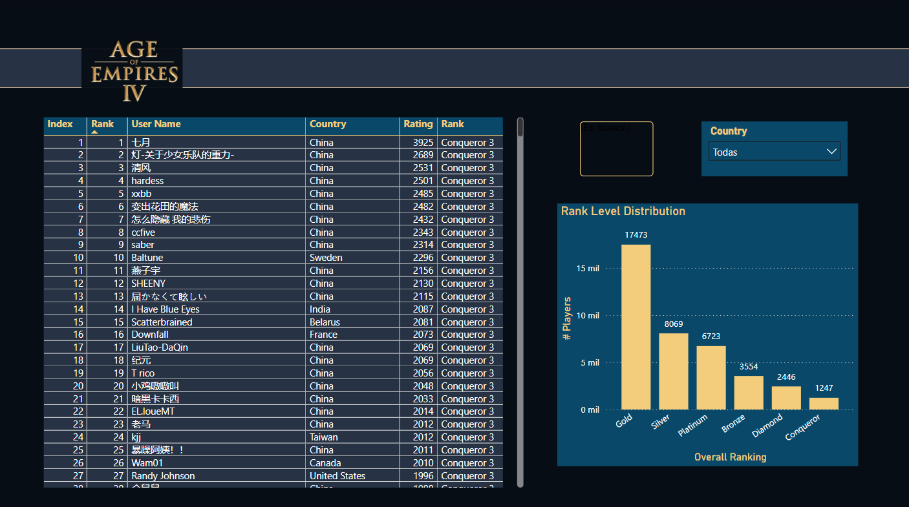

#### Slicers

The only slicer that have been added to this visualization is the country. For this visualization the continent was not added as part of a potential slicer.

Next to the Country Slicer, a space to display the flag of the country selected has been added. This would only show 1 flag if only 1 country is selected. and if there are multiple country selected it would no display any flag. 

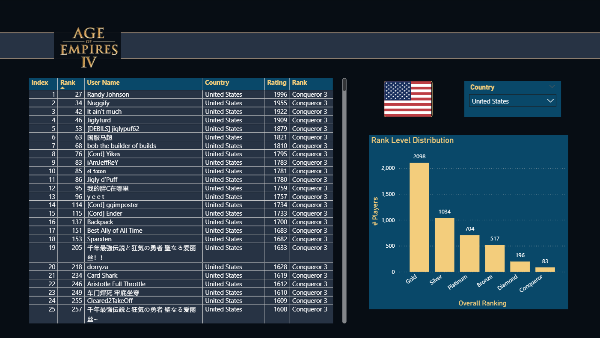


#### Rank Table

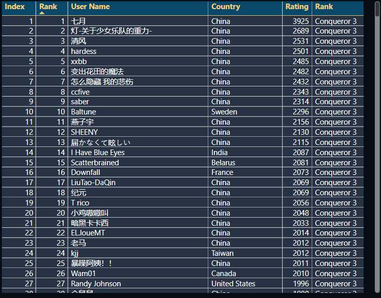

The information that can be seen in the table are: 

- Index
- Rank
- User Name
- Country
- Rating


The 'Index' display the sub ranking of the player based on the slicers selected. For example if a country or group of countries are selected, the sub ranking would depend on that selection. 

The 'Rank' displays the specific ranking of the player obtained directly from the API. 


The calculation used for the 'Index' was as follows:

``` DAX

index =
	CALCULATE(
	    COUNTROWS(df),
	    FILTER(ALLSELECTED(df), df[rank] <= Max(df[rank]))
	)

```

This calculation compared to the one used for the 1v1 is a bit shorter due to the 'Continent' element of the countries has not been added as a a slicer.  

The following show the table when a country is selected: 
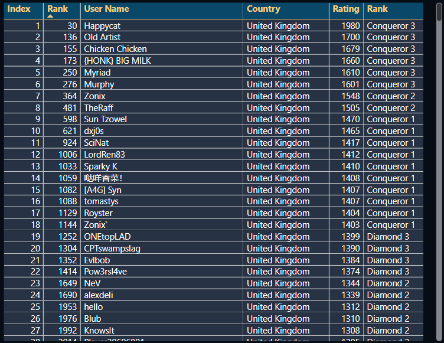

#### Number of Players based on overall ranking

The following is a bar graph that displays overall ranking distribution from the players that are in the selection. 

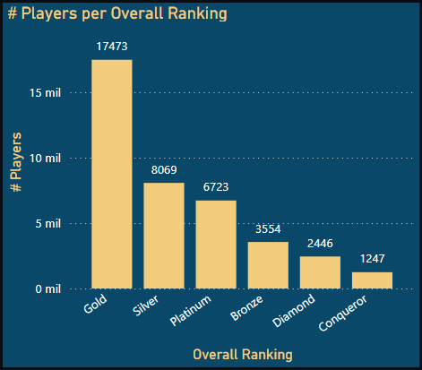

#### Consideration of this Dashboard
The information for this Dashboard obtains all the information from the AOE4 World database by requesting all the information that is available at the moment from the leaderboard. As mentioned all dashboards are done to display the way to obtain the information from the site rather than requesting the information continuosly that should not be neccesary.

## 7. Conclusions and Insights

- At the time of obtaining the data there were around 32,000 players active playing the 1v1 ladder and around 39,000 playing team games.
- Most of the player base are from China and the United States.
- Looking at the best players considering "Conqueror 3" in 1v1 they have played an approximately 300 games compared to an "average" who would be a "Gold" player that has approximately only 99 games considering they are in "Gold 3". Also based on this rankings, a player from "Conqueror 3" would have a median game time around 21 minutes compared to their Gold counterparts that would play a median of 25 minutes. Here it needs to be noted that due to the configuration of the ranks, some players exceeds by a lot of points the "Conqueror 3" label as it is needed 1,600 points but some of the players observed had around 2,300 points. 
- Considering the win rates it seems that Jean d'Arc and Ayyubids are some of the best civilizations to play at the time when the information was requested.
- It was observed that some civilizations seems stronger in certain maps than others based on the data, but variables as potential civilization counter plays might still be at play when the civilizations are chosen.


