# COVID 19 Project

## 1. Project Overview

### 1.1 Scope

This project has the purpose to observe the evolution of the data of COVID, which countries have controlled better or worst the pandemic and analyze potential factors that might have affected the results.

### 1.2 Goals

- Analyze the countries that had more death based on population (also this based on certain period)
- Compare countries also by continent
- Which dates were the worst for each country

### 1.3 Limitations

- The data is not live so data need to be updated manually
- The database only used locally

### 1.4 Considerations

The data that was managed could have been worked all in one table as the original dataset was created that way. Here data was split to relate working with SQL functions like JOIN. 

This project was worked specifically with PostgreSQL.


This project was based on the following project idea / tutorial from the YouTube channel "Alex The Analyst".

### 1.5 Points of improvement

- The data could be connected with the Python library created by the organization so most recent data could be connected. 


### 1.6 Tools used

- Postgres SQL
- Power BI


## 2. Inspiration and Metadata

This project was based on the following project idea / tutorial from the YouTube channel "Alex The Analyst". This channel is oriented on different aspects of Data Analytics like overviews of what is Data Analytics, how you can start on it, tutorials etcetera. This is the link for the specific video. [Data Analyst Portafolio Project | SQL Data Exploration | Project 1/4 - Alex The Analyst](https://www.youtube.com/watch?v=qfyynHBFOsM)

The information worked on this project is based on the site 'Our World in Data'. Here is the link for the specific section were data can be obtained. [Our World in Data - Covid](https://ourworldindata.org/covid-deaths)

## Reviewing Data before working on it 

### Data ROCCC 

**Reliable**
The information depends on the numbers that are presented by governments of each country. Any problems from the information depends on how countries have reported their information.

**Original**
This is not the original data source as they obtain the information is gathered from Johns Hopkins University of Medicine and more specifically from their Coronavirus Research Center. And this information is gathered based on the information they obtain from the governments around the world.

**Comprehensive**


**Current**
The information is current as they have update of information until one the day before the data was downloaded. Any insights taken can be considered with the current information. Take into consideration that from time to time the information has been updated as some data that was presented at a start was not the correct one. 

**Cited**
The dataset has been obtained from Johns Hopkins University of Medicine. The information that is gathered by Johns Hopkins University of Medicine, depends on the data that is presented by the different governments worldwide.

## 3. Data Structure

### 3.1 Structuring Data on PostgreSQL

#### 3.1.1 Adding Tables in PostgreSQL
As mentioned before the data was divided in two tables based on the table that can be downloaded from Our World in Data.

The first step was to create a Database in PostgreSQL. The database was created with SQL Shell (psql), for practicing using the commands in that environment. This is the code for creating the database: 

``` PostgreSQL
CREATE DATABASE covid_project;
```

After that the first table was created also in psql but by running a SQL file that was created using an Excel template I created and Sublime text so the information can be changed to a SQL file. The tittle of this table is **covid_death**. Here is the code: 

``` PostgreSQL
CREATE TABLE covid_death(
	iso_code varchar(50),
	continent varchar(50),
	location varchar(50),
	date date,
	population bigint,
	total_cases bigint,
	new_cases integer,
	new_cases_smoothed double precision,
	total_deaths bigint,
	new_deaths bigint,
	new_deaths_smoothed double precision,
	total_cases_per_million double precision,
	new_cases_per_million double precision,
	new_cases_smoothed_per_million double precision,
	total_deaths_per_million double precision,
	new_deaths_per_million double precision,
	new_deaths_smoothed_per_million double precision,
	reproduction_rate double precision,
	icu_patients bigint,
	icu_patients_per_million double precision,
	hosp_patients bigint,
	hosp_patients_per_million double precision,
	weekly_icu_admissions bigint,
	weekly_icu_admissions_per_million double precision,
	weekly_hosp_admissions bigint,
	weekly_hosp_admissions_per_million double precision
);
```

After that the vaccination table was created but with the own pdAdmin4 by running a Query directly. The table was named **covid_vaccination**. Here is the code used: 

``` PostgreSQL

CREATE TABLE covid_vaccination(
	iso_code varchar(50)  ,
	continent varchar(50)  ,
	location varchar(50)  ,
	date date  ,
	new_tests int  ,
	total_tests bigint  ,
	total_tests_per_thousand double precision  ,
	new_tests_per_thousand double precision  ,
	new_tests_smoothed int  ,
	new_tests_smoothed_per_thousand double precision  ,
	positive_rate double precision  ,
	tests_per_case double precision  ,
	tests_units varchar(50)  ,
	total_vaccinations bigint  ,
	people_vaccinated bigint  ,
	people_fully_vaccinated bigint  ,
	total_boosters bigint  ,
	new_vaccinations int  ,
	new_vaccinations_smoothed bigint  ,
	total_vaccinations_per_hundred double precision  ,
	people_vaccinated_per_hundred double precision  ,
	people_fully_vaccinated_per_hundred double precision  ,
	total_boosters_per_hundred double precision  ,
	new_vaccinations_smoothed_per_million int  ,
	new_people_vaccinated_smoothed bigint  ,
	new_people_vaccinated_smoothed_per_hundred double precision  ,
	stringency_index double precision  ,
	population_density double precision  ,
	median_age double precision  ,
	aged_65_older double precision  ,
	aged_70_older double precision  ,
	gdp_per_capita double precision  ,
	extreme_poverty double precision  ,
	cardiovasc_death_rate double precision  ,
	diabetes_prevalence double precision  ,
	female_smokers double precision  ,
	male_smokers double precision  ,
	handwashing_facilities double precision  ,
	hospital_beds_per_thousand double precision  ,
	life_expectancy double precision  ,
	human_development_index double precision  ,
	excess_mortality_cumulative_absolute double precision  ,
	excess_mortality_cumulative double precision  ,
	excess_mortality double precision  ,
	excess_mortality_cumulative_per_million double precision
);
```

After adding the 2 datasets to PostgreSQL, then some insights could be obtained.

### 3.1.2 Exploring the information

After adding the information to PostgreSQL a review of the information was done. Some of the important points to consider are the following:
- The data is structured by each specific country but also there are aggregation groups by continents, worldwide and also by income levels or others like the European Union. 
- There are multiple entries for population for every date, it is a constant value between all dates. (Static values that repeat themselves)
- In the covid death table in the column "new_deaths" there are some values that are negative. Most likely were adjustment from deaths that initially were considered due to covid but then corrected. These values are going to be considered as there would not be a way to distribute the deaths in the correct days or to be ignored as it would affect the total amount of deaths, but it is important to realize that they would be in the data to be analyzed.

Here are the queries and examples while the information was being reviewed in order of being mentioned. 

**Structure for countries and continents**

The following query would show all the locations, based on population.

``` PostgreSQL
SELECT location, continent, cast(avg(population) as bigint) as population
FROM covid_death
GROUP BY location, continent
ORDER BY population DESC
```

With this query, it can be observed that the location could be used for other aggregations as explained:

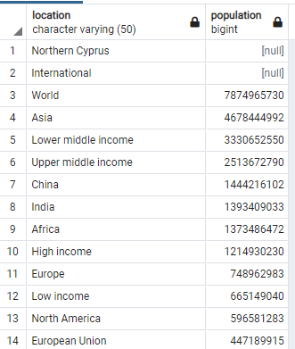

Something that also shows up its that "Northern Cyprus" and "International" have null population. In the case of "Northern Cyprus" no information was added to the database and for "International" no population is shown but it also had other columns with data.

To only query the information per country, the following query was done:

``` PostgreSQL
SELECT location, continent, cast(avg(population) as bigint) as population
FROM covid_death
WHERE continent is not null
GROUP BY location, continent
ORDER BY population DESC
```

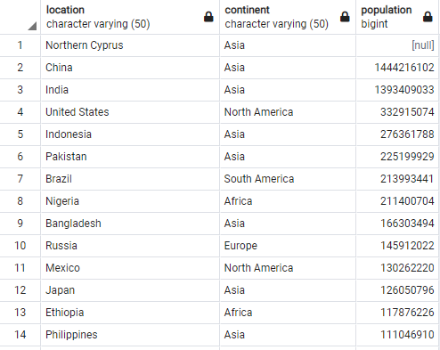


**Constant in Population value**

The following query shows the maximum, average and difference between both in population.

``` PostgreSQL

SELECT location, MAX(population), cast(AVG(population) as bigint), cast((MAX(population)-AVG(population)) as bigint) as max_avg
FROM covid_death
GROUP BY location
ORDER BY max_avg DESC 

```

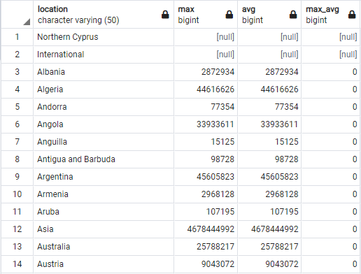

As it can be shown by the table, there is on difference between values of the population so maximum or average can be used on aggregation. This would obviously consider a constant through the years of analysis even though deaths due to the virus is being analyzed. 

**Negative deaths values**

The following query displays the negative values found from the 'new_deaths' field. 

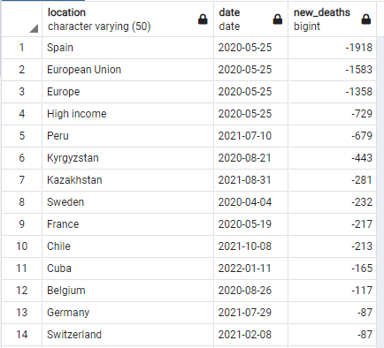


### 3.2 Querying information in PostgreSQL


After adding the information to PostgreSQL, some queries were made to answer some of the following questions:

- Day in which most deaths due to COVID occurred per country.
- Total deaths per country by COVID comparted to its population
- Death Ratio based on the amount of cases reported by country
- Hospitalization and Intensive Care Unit (ICU) patients ratio
- Vaccination ratio


**Day in which most deaths due to COVID occurred per Country**
``` PostgreSQL 

	SELECT cdmd.location, cdmd.new_deaths, cd.date
	FROM covid_death AS cd
	RIGHT JOIN 
		(
		SELECT location, max(new_deaths) as new_deaths
		FROM covid_death
		WHERE continent IS NOT NULL
		GROUP BY location) cdmd
		ON cd.location = cdmd.location
		AND cd.new_deaths = cdmd.new_deaths
	WHERE continent IS NOT NULL
```

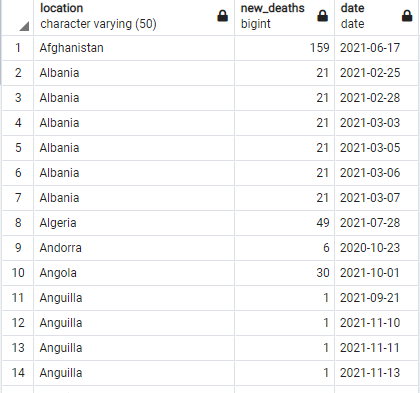

For looking at the countries that had multiple peaks the following query was added.

``` PostgreSQL

	SELECT a.location, count(a.location)
	FROM(
	SELECT cdmd.location, cdmd.new_deaths, cd.date
	FROM covid_death AS cd
	RIGHT JOIN 
		(
		SELECT location, max(new_deaths) as new_deaths
		FROM covid_death
		WHERE continent IS NOT NULL
		GROUP BY location) cdmd
		ON cd.location = cdmd.location
		AND cd.new_deaths = cdmd.new_deaths
	WHERE continent IS NOT NULL
	) a
	GROUP BY a.location
	ORDER BY count DESC

```

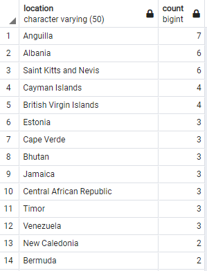

**Total deaths per country by COVID comparted to its population**

``` PostgreSQL

	SELECT location, max(population), max(total_deaths) as total_death, 
	cast((cast(max(total_deaths) AS float)/max(population))*100 as DECIMAL(4,2)) as death_ratio
	FROM covid_death
	WHERE continent IS NOT NULL
	GROUP BY location
	HAVING max(total_deaths) IS NOT NULL 
	ORDER BY death_ratio DESC
	
```

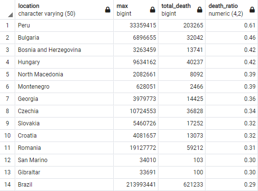

**Death Ratio based on the amount of cases reported by country**

``` PostgreSQL

	SELECT location, MAX(total_cases) AS total_cases, MAX(total_deaths) AS total_deaths, CAST(((CAST(MAX(total_deaths) AS FLOAT)/MAX(total_cases))*100) AS DECIMAL(5,2)) AS ratio
	FROM covid_death
	WHERE continent IS NOT NULL
	GROUP BY location
	HAVING  ((CAST(MAX(total_deaths) AS FLOAT)/MAX(total_cases))*100) IS NOT NULL
	ORDER BY ratio DESC

```

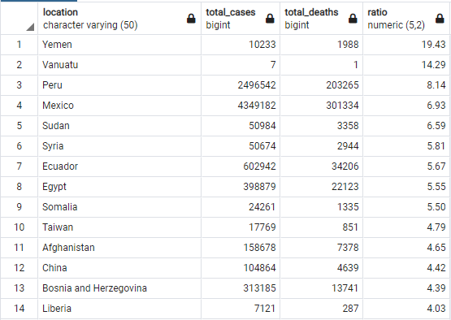

**Hospitalization patients ratio**

``` PostgreSQL

SELECT location, SUM(icu_patients) AS total_icu_patients, SUM(hosp_patients) AS total_hosp_patients, CAST((SUM(icu_patients)/SUM(hosp_patients))*100 AS DECIMAL (4,2)) AS icu_pct
	FROM covid_death
	WHERE icu_patients IS NOT NULL and hosp_patients IS NOT NULL
	GROUP BY location
	ORDER BY icu_pct DESC

```

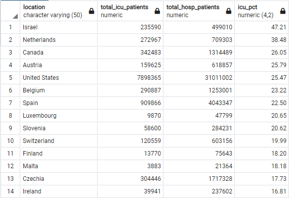

**Vaccination ratio**

``` PostgreSQL

SELECT cd.location, MAX((cv.people_fully_vaccinated)) as fully_vaccinated, MAX((cd.population)) as population, 
	CAST((((MAX(cv.people_fully_vaccinated)))/(cast(MAX(cd.population)as float))*100) AS DECIMAL (7,3)) AS vac_ratio
	FROM covid_death AS cd
		FULL JOIN covid_vaccination AS cv
		ON cd.location = cv.location
		AND cd.date = cv.date
	WHERE cd.continent IS NOT NULL 
	GROUP BY cd.location
	ORDER BY vac_ratio DESC
	
```


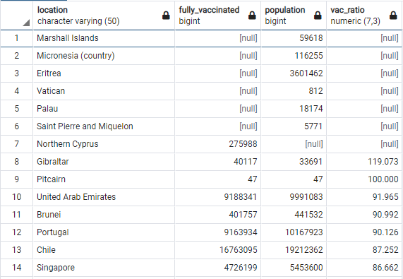


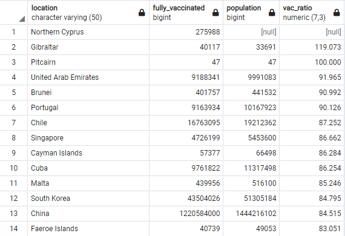


### 3.3 Transforming Data in Power Query

The table structure is worked mostly without change except for the table "people_vaccinated". In this case an extra column was added (even though it could be replaced) values from the the vaccination. 

This added column was created to fill data because the data from vaccination updates had the cumulative values from the vaccination, but when no new update from the values was 'blank'. The transformation of the data was to fill the dates were vaccination was null/blank to have the  last date available. To generate that specific point, the following code in Power Query was added:

``` powerquery
= Table.Group(#"Columna duplicada", {"location"}, {{"Recuento", each Table.FillDown(Table.Sort(_, {"date"}),{"people_fully_vaccinated - Copia"}), type table [location=nullable text, date=nullable date, people_vaccinated=nullable number, people_fully_vaccinated=nullable number, #"people_fully_vaccinated - Copia"=nullable number]}})
```

Just as note, this can not be done just by using the fill down option as data can get filled in the wrong position.

For some of the visualization of general data, a temp table could have been done to obtain this information, but the information would not have been useful for a graph to show the evolution of the vaccination world wide. That is the reason why data needed to be filled. 

This could also been done in SQL.

### 3.4 Connecting the tables in Power BI

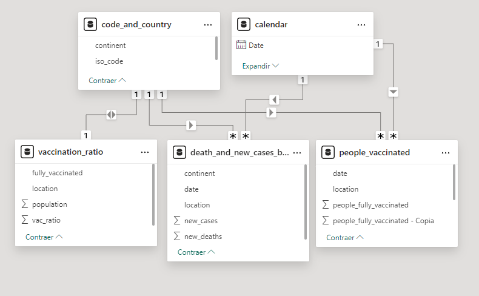

The primary tables in this case are "code_and_country" and "calendar". The "code_and_country" table key is the "location" field, which contains the country. The "calendar" table align the dates between the "death_and_new_cases_by_date" and "people_vaccinated".

The connections of the tables are as follows: 

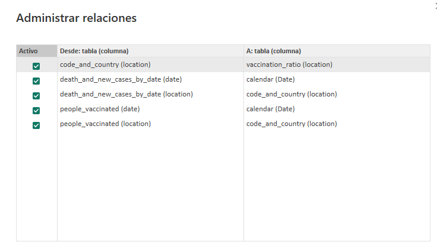

## 4. Dashboard


This is the final project visual: 

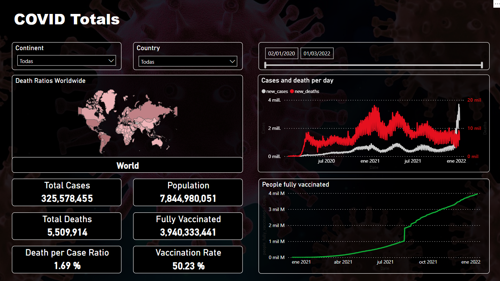


After the title, in the top section it can be seen 3 slicers for the project. 

### Slicers

The slicers correspond to 
- Continent
- Country
- Dates

### Visualizations

In the visualizations the following field can be seen 

- Death Ratios Worldwide
- Cases and death per day
- General information of the country
- People fully vaccinated


The general information of the country contains: 
- Total Cases
- Total Deaths
- Death per Case Ratio
- Population
- Fully Vaccinated
- Vaccination Rate

#### Death Ratios Worldwide

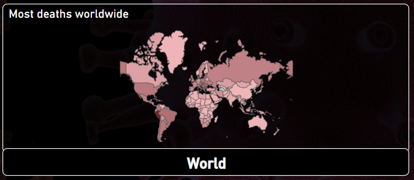
The map colors for each country depends in the ratio of deaths per million habitants in a specific country. The ones with lighter colors have a lower ratio and the ones with darker color a higher one. 

For calculating the death per million the following measure was created: 

``` DAX

death_per_millions = 
	(SUM(death_and_new_cases_by_date[new_deaths])
	/
	SUM(vaccination_ratio[population])
	*
	1000000)
```

Based on the selection from the slicer, the map would show the specific section with the name. If nothing is selected from the map or the slicers, then it would display "World".  If a "Continent" (in the slicer) is selected then it would display the continent in the map and below the name of the selection. 


Finally if a country is selected, the country would be displayed. In the case multi-select using the map it would take into consideration the last one picked. If it by using the "Country" slicer, then it would display the last alphabetical country selected, and all the non selected country would be displayed as gray in the map. 

The map was obtained based on the YouTube channel Curbal with her video [Map locations using Power BI shape maps (Part 1)](https://youtube.com/watch?v=Hzy1YbTjDaA) which uses a json map created / recollected by David Eldersveld in his [GitHub](app://obsidian.md/%5Bhttps://github.com/deldersveld/topojson%5D). The map downloaded was this specific [World Map json](https://github.com/deldersveld/topojson/blob/master/world-continents.json).

For the name selection, a measure was used to display the information of "World", a specific continent or country that was selected. 

``` DAX
country_if_filtered =
	IF(
		OR(
			ISFILTERED(code_and_country[iso_code]),
			ISFILTERED(code_and_country[location])
		),
		LASTNONBLANK(code_and_country[location],1),
		IF(
			ISFILTERED(code_and_country[continent]),
			LASTNONBLANK(code_and_country[continent],1), 
			"World"
	)

```

#### Functions used

[IF() - DAX](IF()%20-%20DAX.md)
[OR() - DAX](OR()%20-%20DAX.md)
[LASTNONBLANK() - DAX](LASTNONBLANK()%20-%20DAX.md)
[ISFILTERED() - DAX](ISFILTERED()%20-%20DAX.md)


#### Cases and death per day

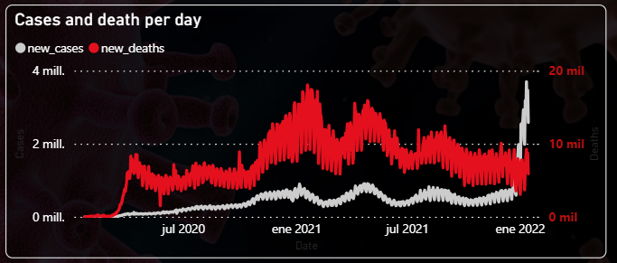

For the graph in the X-Axis the date is used and for the principal Y-Axis the number of person that have been diagnosed with COVID-19 and in the secondary Y-Axis the people who have died due to this decease. No DAX calculations were needed and for both of the Y-Axis calculations, the sum aggregation of 'new_cases' and 'new_deaths' from the 'death_and_new_cases_by_date' table were used for the principal and secondary axis respectively.


#### Cases and death per day

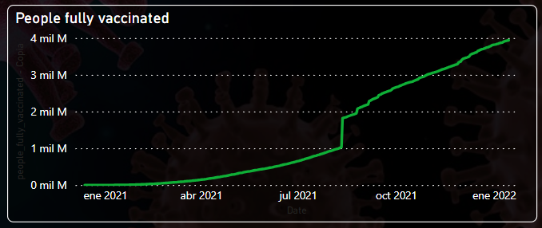

For the graph in the X-Axis the date is used and for the  Y-Axis the number of person that have been fully vaccinated against COVID-19. No DAX calculations were needed and for the Y-Axis calculation, the sum aggregation of 'people_fully_vaccinated - copia' from the 'people_vaccinated' table. This is column had a rework in Power Query which has already been described. 


#### General Information of the country


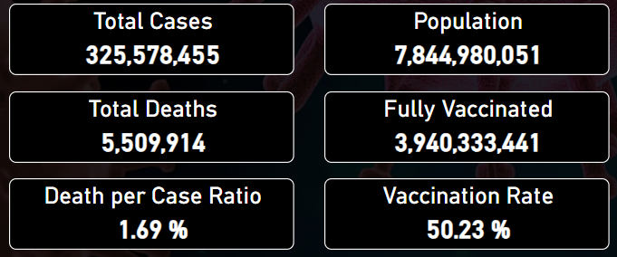

**Total Cases**
"Total Cases" does not have a DAX measurement, it is the sum of the 'new_cases' from the 'death_and_new_cases_by_date' table. 

**Population**
"Total Cases" does not have a DAX measurement, it is the max value of 'population' from the 'vaccination_ratio' table. 

**Total Deaths**
"Total Deaths" does not have a DAX measurement, it is the sum value of 'new_deaths' from the 'death_and_new_cases_by_date' table. 

**Fully Vaccinated**
"Fully Vaccinated" had the following measurement:

``` DAX

fully_vacc_max_val = 
	CALCULATE(
		SUM(people_vaccinated[people_fully_vaccinated - Copia]),
		LASTDATE(people_vaccinated[date]) 
	)

```


**Death per Case Ratio**
"Death per Case Ratio" had following measurement:

``` DAX

death_ratio_val =
	SUM(death_and_new_cases_by_date[new_deaths])
	/
	SUM(death_and_new_cases_by_date[new_cases])

```

**Vaccination Rate**
"Vaccination Rate" had the following measurement:

```DAX

fully_vacc_ratio_val =
	people_vaccinated[fully_vacc_max_val]
	/
	(SUM(vaccination_ratio[population]))
```
[CALCULATE() - DAX](CALCULATE()%20-%20DAX.md)
[SUM() - DAX](SUM()%20-%20DAX.md)
[LASTDATE() - DAX](LASTDATE()%20-%20DAX.md)